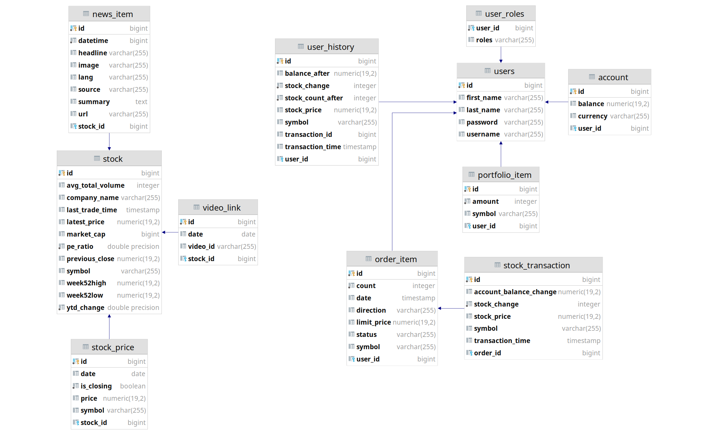

# OVERVIEW - Stock exhange platform (monolith edition)

This repository contains the APIs, database, and other core infrastructure items needed for the stock exchange web application.
Front-end repository is available here: https://github.com/FruzsinaElekes/stockExchangePlatform.git

The server is written in Java using the Spring Framework and Spring Boot.
Spring Data, Spring Security, Spring MVC and Spring Messaging (websockets) modules are used in the server to provide stable and secure backend for the application.

# HOW TO RUN

After cloning the repository, create an application.properties file based on the application.properties.template in 'src/main/resources' folder:
 - Set up the required parameters for the database connection.
 - If required, database updates from outer API can be set up. The necessary API access keys can be aquuired from the following sites:
    - Stock static data: https://iexcloud.io/
    - Related stock videos: https://developers.google.com/youtube/v3
 - If the frontend server will be running on different origin, specify it in the 'cors.allowed.path' accordingly.

To start the development server locally:
<pre><code>
mvn spring-boot:run
</code></pre>
At default the server will start at: http://localhost:8080

**DEPLOYMENT:**

If the static files are created from the React app, the files should be moved 'src/main/resources/public' folder and the whole application can be deployed as one.

*Deployment on Heroku:*

Create a Heroku configuration file in root directory of the repository named as 'system.properties'. The file defines the necessary java version to run the application.

<pre><code>
java.runtime.version=11
</code></pre>

Heroku 'Procfile' should be created in root directory to define the command necessary for running the application.

<pre><code>
web: java -jar target/stockexchange-0.0.1-SNAPSHOT.jar --server.port=$PORT --spring.config.location=target/classes/production.properties
</code></pre>

Create a spring configuration file named as 'production.properties' in the 'src/main/resources' folder based on the 'application.properties.template'.
The datasurce and jpa configurations should be replaced with the following items.

<pre><code>
spring.datasource.driver-class-name=org.postgresql.Driver
spring.jpa.generate-ddl=true
</code></pre>

As the last step push the repository to the heroku git remote to deploy the application.

# MAIN FEATURES OF THE WEB APPLICATION

The app is a news site for stock market news that also allows you to simulate trading.

## 1. News

**Home**

Access a certain stock's detailed page by looking for it in the search bar!

**Detailed View**

The detailed view contains information on the stock's price at previous market close, current price (simulated!), market cap, 52 week range, average volume, year to date change, and last trade time. There is also a graph showing stock prices for the last 30 days. Below, there are news related to the stock: a short video and excerpts from various articles from the last days.

**Favourites**

You can add stocks to the favourites, so you can have a quick overview of your favourite stocks' main statistics or easily access their detailed page. This feature does not require being a registered user of the site, but the content of your Favourites page will be limited to the browser you are using.

_Note that historical prices shown on diagrams are valid data retrieved from the IEXCloud API. Intraday changes in stock prices are, however, simulated!_

## 2. Trading

To be able to simulate trading you need to **register** to the site and log in. Upon registration you will receive a mock account with 10 000 USD.

**Trade**

You can buy or sell stock on the Trade page by specifying the symbol, the action (buy/sell), the amount and the limit price for the transaction. When clicking Trade, a confirmation dialog is shown with the details of the order you are about to place. The order is only finalized when confirming the placement. If, for some reason, the transaction could not be made (insufficient funds or owned stock, mismatch between current stock price and the limit price) a modal window will notify you about the error. Upon making a successful transaction, you will be redirected to the portfolio page.

**Portfolio**

On the Portfolio link you will find information about your account (username, current balance, and current total worth of your portfolio). Also, you will see the details of your portfolio, specifying the amount you own of each stock. Clicking on the History button, you can access the full transaction history for a given stock.

# BACKEND DESIGN

### Database structure

Spring Data
Hibernate
PostgreSQL

### Security

JSON web token

### Communcation

STOMP on websocket
